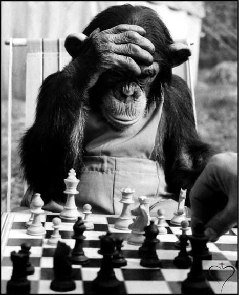

     
    
    <h3>A chess engine written in Rust</h3>

## Features

- [x] [Bitboard](https://www.chessprogramming.org/Bitboards) board representation
- [ ] Pseudo-legal + legal move generation
- [ ] [Transposition table](https://www.chessprogramming.org/Transposition_Table) with [Zobrist Hashing](https://www.chessprogramming.org/Zobrist_Hashing)
- [ ] [Negamax search](https://www.chessprogramming.org/Negamax)
  - [ ] [Alpha-beta pruning](https://www.chessprogramming.org/Alpha-Beta)
  - [ ] [Iterative Deepening](https://www.chessprogramming.org/Iterative_Deepening)
- [ ] Interfaces with [UCI](http://wbec-ridderkerk.nl/html/UCIProtocol.html) programs
- [ ] [Opening book](https://www.chessprogramming.org/Opening_Book)
- [ ] A simple evaluation function
  - [ ] Material count
  - [ ] Piece positioning
- [ ] [FEN](https://en.wikipedia.org/wiki/Forsyth–Edwards_Notation)-to-position and position-to-FEN

## Extra Features (if we finish the basic ones)
- [ ] A more advanced evaluation function
  - [ ] Game phase evaluation
  - [ ] ???
- [ ] [Move ordering](https://www.chessprogramming.org/Move_Ordering)
- [ ] [Threading](https://en.wikipedia.org/wiki/Pthreads) to parallelize move generation, search, and evaluation

## Usage
- [ ] Command line executable
  - [ ] Evaluates/analyzes positions
  - [ ] Play games against the computer
- [ ] Hosted as an official bot on Lichess
